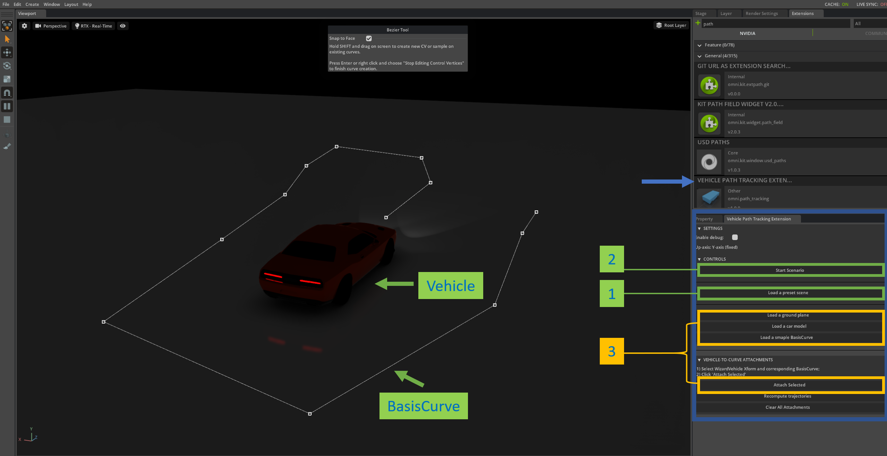
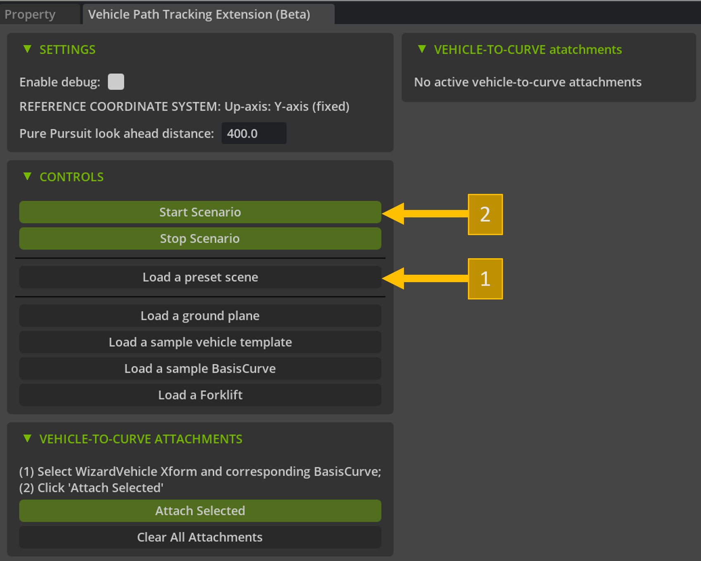
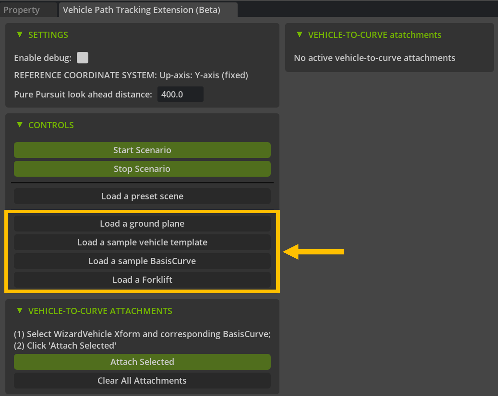
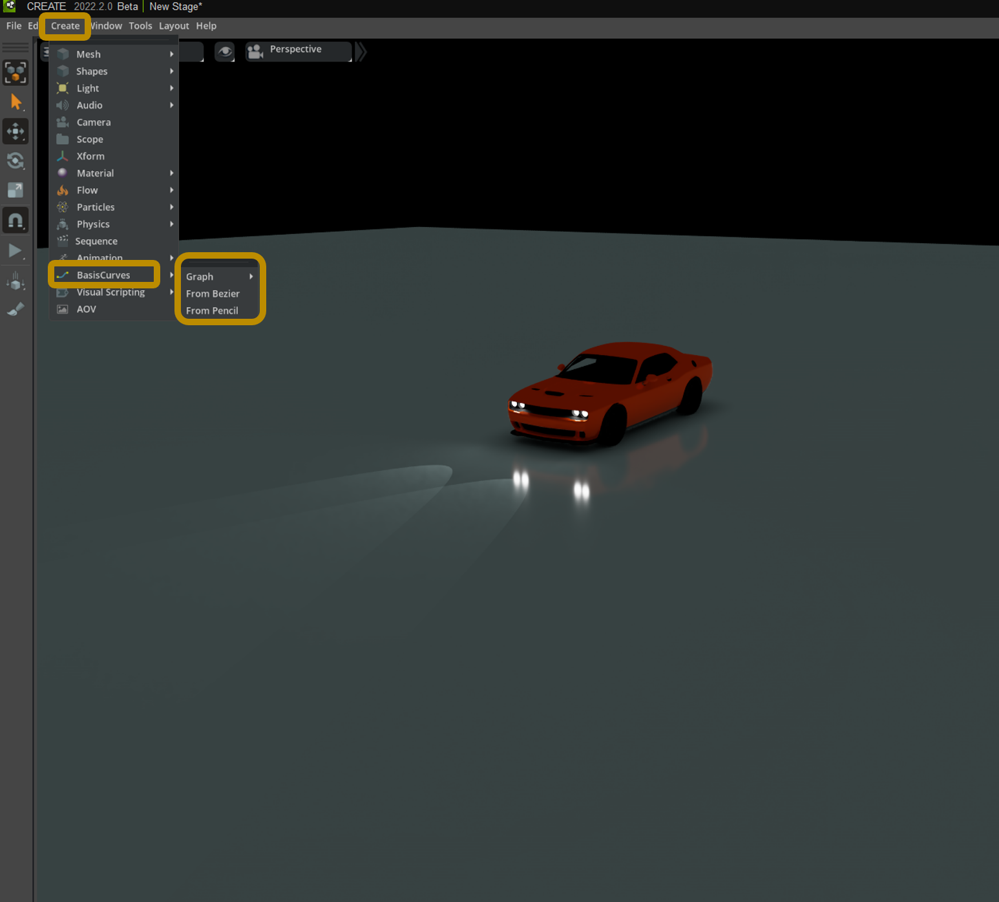
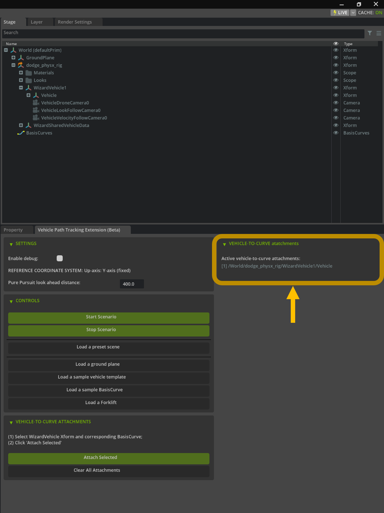
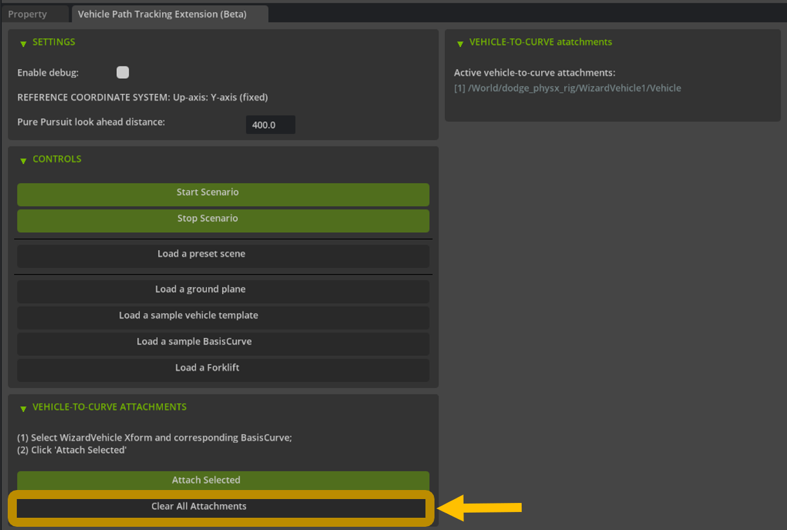

# Vehicle Path Tracking Extension

## 1. About

Omniverse Vehicle Path tracking extension allows a physics-enabled vehicle created
with a PhysX Vehicle extension (omni.physx.vehicle) to move and automatically track a user-defined path.
User-defined path is represented by an instance of USD BasisCurves, and a path tracking algorithm
is inspired by a classic Pure Pursuit algorithm [3].

Figure 1. Preview of Vehicle Path Tracking Extension

### System Requirements:

- `Code 2022.1.3+` or `Create 2022.1.5+`
- `Pyhton 3.7+`, `numpy` (this requirement should be satisfied when using Omniverse Kit's embedded `CPython 3.7`)

### Limitations

For the moment the extension is simple and a number of 
shortcuts has been taken and a few simplification applied, including the follwoing:

* Pure Pursuit Tracking algorithm is kinematics-based and therefore a number of physics vehicle dynamics
properties are not taken into account, such as tire slipping etc. 
* A vehicle might go off the track if proposed an input path of a physically "impossible" trajectory, or at high speed turn.
* Limited unit test coverage; occasional bugs might exist.

### Future Work

* implement automatic computation of vehicle path which satisfies certain constraints (waypoints, collision free path etc.);
* Add support for different path tracking algorithms including more sophisticated ones;
* Getting rid of limitations, bugfix.

## 2. Installing Extension

Pre-requisites:
* `Git`
### Add a Git URL to Omniverse extension search path (optioni 1)

Inside Omniverse Code or Create:
1. `Window` -> `Extension Manager` -> ⚙️ `Gear Icon` -> `Extension Search Path`
2. Add the following git url as an new search path: `git://github.com/iirthw/kit-extension-path-tracking?branch=main&dir=exts`

### Add a path to a local clone to Omniverse extension search path (option 2)

1. `git clone -b main $PATH_TO_DIR`
2. `Window` -> `Extension Manager` -> ⚙️ `Gear Icon` -> `Extension Search Path`
3. Add a path to just cloned extension as an extension search path: `$PATH_TO_DIR/exts`

### Activate extension

When extension search path configuration is done, start the extension:
1. `Window` -> `Extension Manager`
2. Find Vehicle path tracking extension in the list and enable it (Figure 2)

 
Figure 2. Activating path tracking extension in extension manager. 

---

## 3. Getting Started

### 3.1. Evaluate vehicle path tracking on a preset configuration

The fastest way to evaluate how vehicle path tracking extension works is to use a preset vehicle and curve (could be considered as `HelloWorld` before importing your own physx-vehicle and custom paths).
In order to get started with the preset configuration please proceed as follows (Figure 3):
1. Click `Load a preset scene` button
2. Click `Start scenario` button

 
Figure 3. Getting started with a preset scene.

The extension also allows a quick way to load a ground plane, a sample physics vehicle, and a sample basis curve. See Figure 4.

 
Figure 4. Other extension controls.

---

### 3.2. Create your custom vehicle-to-curve attachment setup

Extension supports path tracking for any Omniverse PhysX Vehicle.
One could load a template vehicle using the extension ui, or using a conventional method via `Create`->`Physics`->`Vehicle`.
It is also straightforward to add a custom mesh and materials to a physics vehicle [2].

You can create a curve for vehicle path tracking using either of the following methods (Figure 5):
- `Create`->`BasisCurves`->`From Bezier`
- `Create`->`BasisCurves`->`From Pencil`

  |   
Figure 5. Create a custom path to track via USD BasisCurves.

---

Once a physics vehicle and a path to be tracked defined by USD BasisCurves is created, select the WizardVehicle and the BasisCruves prims in the stage (via Ctrl-click)
and click `Attach Selected` button. Note that is very important to select specifically `WizardVehicle` prim in the scene,
not `WizardVehicle/Vehicle` for instance.
Please see Figure 6 for the illustration.

 
Figure 6. Attachment of a path (USD BasisCurves) to a physics-enabled vehicle.

If vehicle-to-curve attachment was successful it should be reflected on the
extension UI (Figure 7).

 
Figure 7. Successful vehicle-to-curve attachment is shown on the right side.

When vehicle-to-curve attachment(s) is created, proceed by clicking Start Scenario button.

If you want to get rid of all already existing vehicle-to-curve attachments please click `Clear All Attachments` (Figure 8).
It is very important to clear vehicle-to-curve attachments, when changing vehicles and corresponding tracked paths.

 
Figure 8. Removing existing vehicle-to-curve attachments.

### 3.3. Multiple Vehicles

The extension supports multiple vehicle-to-curve atttachments.
Note, that in order for attachment to work, a pair of `WizardVehicle` and
`BasisCurve` objects should be selected and attached in a consequent manner.
Results of path tracking with multiple vehicles is shown on Figure 9.

   
Figure 9. Support of multiple vehicle-to-curve attachments.

### Troubleshooting

Note that extension is in Beta. The following items might be of help if any issues:

- It always takes a few seconds between clicking 'Start scenario' button and actual start of the simulation, so please be patient;
- On a fresh install some physx warnings/errors might be occasionally reported to the console log, they should not prevent the extension from producing expected results though;
- If path tracking is not working on a custom vehicle and path, please verify that exactly `WizardVehicle1` from omni.physx.vehicle is selected (not a child prim 'WizardVehicle1/Vehicle' or some parent prim) along with a prim of type `BasisCurves` (which is to be tracked) before clicking 'Attach Selected';
- Use 'Clear All Attachments` if there are some issues.

---

## 4. References

1. [Omniverse Developer Contest] https://www.nvidia.com/en-us/omniverse/apps/code/developer-contest/
2. [Omniverse Vehicle Dynamics] https://docs.omniverse.nvidia.com/app_create/prod_extensions/ext_vehicle-dynamics.html
3. [Coutler 1992] Coulter, R. Craig. Implementation of the pure pursuit path tracking algorithm. Carnegie-Mellon UNIV Pittsburgh PA Robotics INST, 1992. (https://www.ri.cmu.edu/pub_files/pub3/coulter_r_craig_1992_1/coulter_r_craig_1992_1.pdf)
4. Credits for a forklift model model: https://sketchfab.com/3d-models/forklift-73d21c990e634589b0c130777751be28 (license: [Creative Commons Attribution](https://creativecommons.org/licenses/by/4.0/))
5. Credits for a Dodge Challenger car model: https://sketchfab.com/3d-models/dodge-challenger-ef40662c84eb4beb85acdfce5ac4f40e (license: [Creative Commons Attribution NonCommercial](https://creativecommons.org/licenses/by-nc/4.0/))
