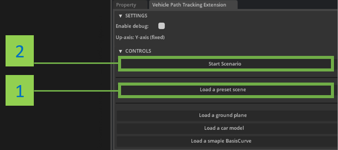
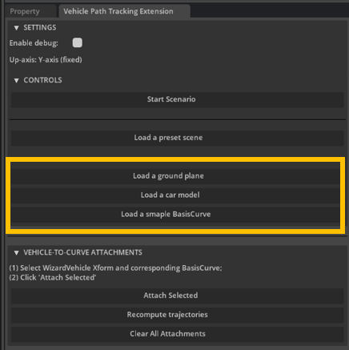
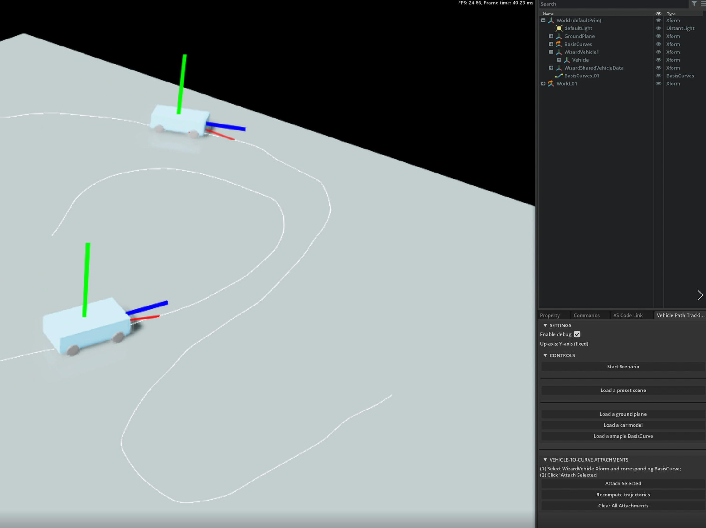

# Vehicle Path Tracking Extension

## 1. About

Path tracking extension allows an instance of omni.physxvehicle to
follow a defined path (Usd BasisCurves) via a path tracking algorithm inspired
by a classic Pure Pursuit algorithm [3].

Figure 1. Preview of Vehicle Path Tracking Extension

### System Requirements:

- `Code 2022.1.3+` or `Create 2022.1.5+`
- `Pyhton 3.7+` (should be the case by default when using Kit's embedded `CPython 3.7`)

### Limitations

For the moment the extension is kept pretty simple and therefore a number of 
shortcuts has been taken, some simplification applied, including the follwoing:

* Pure Pursuit Tracking algorithm is kinematic and therefore does not take into 
account vehicle physics dynamics, such as tire slipping etc. 
* A vehicle might go off the track if proposed a physically "impossible" trajectory, or on high speeds while turning.
* No unit tests; occasional bugs might exist.
* Styling could be actually used and later be extracted into a deicated place, such as `style.py`.

### Future Work

* Getting rid of limitations, bugfix;
* Add an implementation for automatic computation of vehicle path which satisfies certain constraints (points to be visited, obstacle avoidance).

## 2. Installing Extension

It is possible to configure extension search path inside Omniverse Code or Create:
1. `Window` -> `Extension Manager` -> ⚙️ `Gear Icon` -> `Extension Search Path`
2. Add git url as an new search path: `git://github.com/iirthw/kit-extension-path-tracking?branch=main&dir=exts`

After configuring extension search path, start the extension:
1. `Window` -> `Extension Manager`
2. Find in the extension list and enable path tracking extension

---

## 3. Getting Started

UX design of the extension in not polished yet, not everything is absolutely
intuitive, therefore we recommend to get started with the extension by loading
a preset, which will be described in the following section. More advanced usage
will also be described below.

### Launch a Path Tracking on a preset scene

In order to test path tracking on a preset vehicle and curve, please proceed as follows (Figure 2):
1. Click `Load a preset scene` button
2. Click `Start scenario` button

Figure 2. Getting started with preset scene.

The extension allows a quick way to load a ground plane, a sample physics vehicle, and a sample basis curve. See Figure 3.

Figure 2. Quick way to load a ground plane, sample vehicle and basis curve.

---

### Create your custom vehicle-to-curve attachment setup

Extension supports path tracking for any vehicle based on Omniverse Vehicle Dynamics.
One could load a template vehicle using the extension ui, or using conventional method via `Create`->`Physics`->`Vehicle`.
It is also straightforward to add custom mesh and materials to a physics vehicle [2].

You can create a curve for vehicle path tracking using either of the following methods:
- `Create`->`BasisCurves`->`From Bezier`
- `Create`->`BasisCurves`->`From Pencil`

Once physics vehicle and basis curve to track is created, please select the WizardVehicle and the BasisCruves prims (via Ctrl-click)
and click `Attach Selected` button. Note that is very important to select `WizardVehicle` prim in the scene,
not `WizardVehicle/Vehicle` for instance.
Please see Figure 4 for the illustration.

Figure 4. Getting started with a custom vehicle-to-curve attachment.

If you want to got rid of all already existing vehicle-to-curve attachments please click `Clear All Attachments`.

---

### Multiple Vehicles

The extension supports multiple vehicle-to-curve atttachments.
Note, that in order for attachment to work, a pair of `WizardVehicle` and
`BasisCurve` objects should be selected. Although when changing initial vehicle
position e.g. translation in the scene, `WizardVehicle/Vechile` should be translated.

Figure 5. Multiple vehicles.

---

## 4. References

1. [Omniverse Developer Contest] https://www.nvidia.com/en-us/omniverse/apps/code/developer-contest/
2. [Omniverse Vehicle Dynamics] https://docs.omniverse.nvidia.com/app_create/prod_extensions/ext_vehicle-dynamics.html
3. [Coutler 1992, Pure Pursuit Path Tracking Algorithm] https://www.ri.cmu.edu/pub_files/pub3/coulter_r_craig_1992_1/coulter_r_craig_1992_1.pdf
4. [CC Attribution-NonCommercialCreative Commons] Credits for Dodge Challenger car model: https://sketchfab.com/3d-models/dodge-challenger-ef40662c84eb4beb85acdfce5ac4f40e